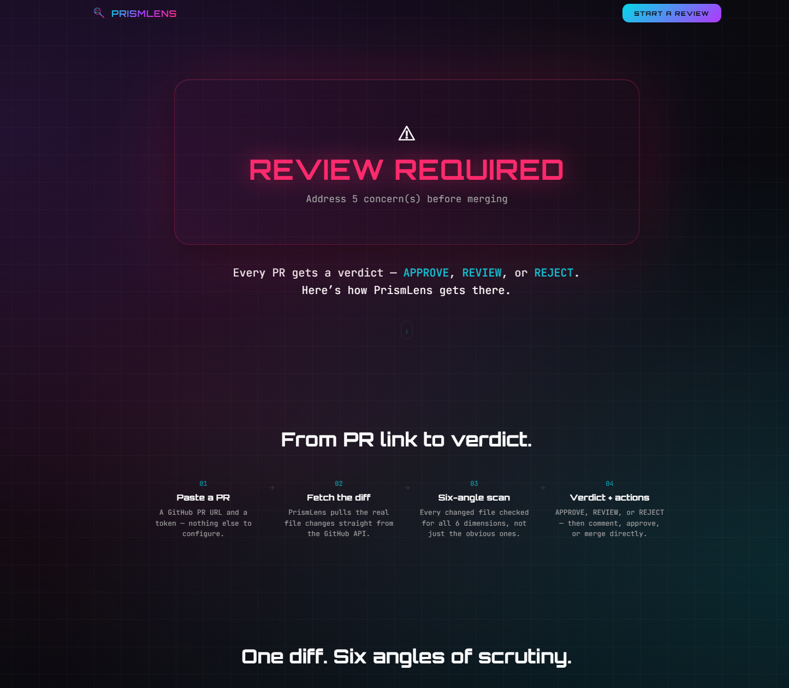
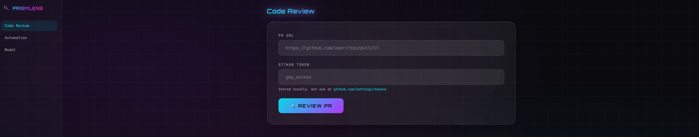
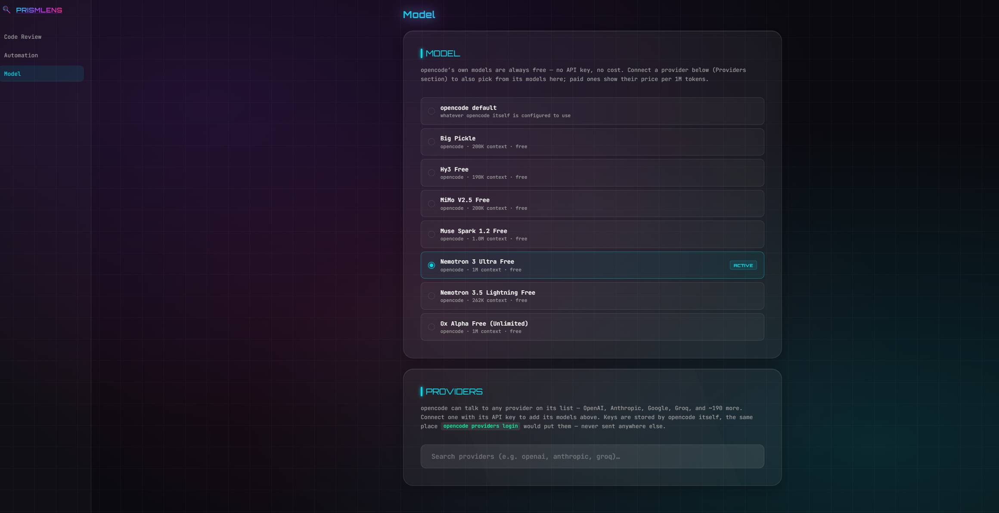
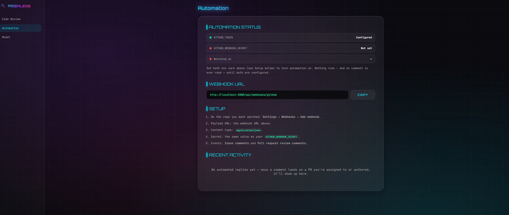

# PrismLens

AI-powered PR review tool with cyberpunk glassmorphism UI and CLI.  
Analyzes every changed file across 6 dimensions: performance, security, readability, bugs, scalability, and best practices.

## Structure

```
prismlens/
├── app/                    # Next.js (App Router) — UI + API, same origin
│   ├── page.jsx             # Landing page ("/")
│   ├── code-review/page.jsx # Code Review page ("/code-review")
│   ├── automation/page.jsx  # Automation page ("/automation")
│   ├── models/page.jsx      # Model page ("/models")
│   ├── activity/page.jsx    # Recent Activity page ("/activity")
│   ├── pending-approvals/page.jsx # Pending Approvals page ("/pending-approvals")
│   ├── layout.jsx
│   └── api/
│       ├── review/route.js             # POST /api/review
│       ├── review/preview/route.js     # POST /api/review/preview
│       ├── review/post/route.js        # POST /api/review/post
│       ├── review/merge/route.js       # POST /api/review/merge
│       ├── chat/route.js               # POST /api/chat
│       ├── health/route.js             # GET /api/health
│       ├── automation/register/route.js # POST/DELETE /api/automation/register — connect/disconnect a GitHub account
│       ├── automation/status/route.js  # GET /api/automation/status — one connected account's status
│       ├── automation/approve/route.js # POST /api/automation/approve — confirm a pending fix
│       ├── automation/dismiss/route.js # POST /api/automation/dismiss — clear a pending fix without approving
│       ├── ai/models/route.js          # GET/POST /api/ai/models — provider registry + live model listing
│       ├── review/describe/route.js    # POST /api/review/describe — auto-generated PR description
│       ├── review/label/route.js       # POST /api/review/label — size/risk labels
│       ├── feedback/route.js           # POST /api/feedback — 👍/👎 on a finding
│       └── webhooks/github/[installationId]/route.js # POST — PR-opened auto-review + comment-reply responder, one URL per connected account
├── components/
│   ├── DashboardShell.jsx   # Shared sidebar/nav wrapping every dashboard page
│   ├── CodeReviewPanel.jsx  # "/code-review" page content
│   ├── AutomationPanel.jsx  # "/automation" page content
│   ├── ModelPanel.jsx       # "/models" page content (AI provider keys + model picker)
│   ├── ActivityPanel.jsx    # "/activity" page content (searchable/filterable event history)
│   ├── PendingApprovalsPanel.jsx # "/pending-approvals" page content (preview/approve/dismiss)
│   └── ChatPanel.jsx
├── lib/
│   ├── api-client.js       # fetch wrapper used by the UI
│   ├── ai-local.js         # client-side storage for provider keys + active model (localStorage)
│   ├── automation-local.js # client-side storage for "which automation installation is mine"
│   ├── automation-poll.js  # shared POLL_MS constant for the dashboard's status polls
│   ├── webhook-verify.js   # GitHub webhook signature verification
│   └── services/
│       ├── github.js       # GitHub API (fetch, post review, merge, reply, describe, label, commit)
│       ├── analyzer.js     # 6-dimension per-file review engine + orchestrates config/dep-scan
│       ├── automation.js   # webhook → analyze comment → reply pipeline, per connected account
│       ├── installations.js # Postgres-backed store for connected accounts (encrypted tokens/secrets)
│       ├── crypto.js       # AES-256-GCM encrypt/decrypt for credentials at rest
│       ├── ai-providers.js # registry of supported AI providers (Gemini, OpenAI, Anthropic, Groq, OpenRouter, Mistral, DeepSeek)
│       ├── ai-models.js    # live model listing per provider
│       ├── ai-review.js    # streams one AI provider's review findings
│       ├── ai-chat.js      # tool-calling chat loop (read_file/commit_file) per provider
│       ├── review-config.js # loads per-repo .prismlens.json (ignore paths, severity overrides, disabled checks)
│       ├── dependency-scan.js # OSV.dev vulnerability scan for package.json
│       ├── json-value-stream.js # streams one JSON finding object per line from an AI provider's response
│       └── feedback.js     # 👍/👎 log, feeds "avoid patterns like this" back into the AI prompt
├── cmd/index.js            # CLI tool (imports analyzer directly)
├── scripts/                # local tooling (e.g. scripts/lint.js)
├── docs/                   # Architecture + API docs
└── package.json
```

## Quick Start

```bash
npm install

# Dev mode — one process, UI + API together
npm run dev             # http://localhost:3000

# Production
npm run build && npm run start

# CLI
npm run review https://github.com/user/repo/pull/17

# Lint (local checks)
npm run lint
```

## Screenshots

| Landing page (`/`) | Code Review dashboard (`/code-review`) |
| --- | --- |
|  |  |

| Model & provider selection | GitHub automation |
| --- | --- |
|  |  |

## Features

- **6-dimension analysis** — every file checked for performance, security, readability, bugs, scalability, and best practices
- **Severity levels** — critical, high, medium, low with visual badges
- **Live review progress** — the dashboard streams the real pipeline as it runs: pulling the codebase tree, running the AI review, scanning dependencies, each step with a live running-time readout, plus a live feed of findings as the AI emits them (no opaque "analyzing…" spinner)
- **Transparent fallback** — if the AI path is unavailable (no provider key configured, an API error, or a timeout), a banner says so and why; partial AI findings found before a timeout are kept rather than thrown away, and the regex fallback runs language-agnostic checks instead
- **Language-aware checks** — JS/TS-specific heuristics (`==` coercion, optional chaining, sync I/O, React APIs) only apply to JS/TS files, so Go/Python/Rust/etc. don't get false-positive "bugs" from idioms those languages use legitimately
- **Richer PR comments & descriptions** — emoji-coded severity/verdict badges (🔴🟠🟡🟢), an at-a-glance per-dimension overview table, and syntax-highlighted, language-tagged code suggestions (```` ```js ```` / ```` ```py ````) in both the posted review and the auto-generated PR description
- **Post to PR** — submit the review as a GitHub PR review comment, with syntax-highlighted code blocks (language-tagged per file, e.g. ```js / ```py) showing a concrete fix across every category, not just performance
- **Auto-generated PR description** — a **Describe** button replaces the PR body with a file-by-file summary + review snapshot generated from the same analysis
- **Size/risk labels** — a **Label** button derives `size/*` and `risk/*` labels from the diff size and verdict and applies them (creating the labels on the repo first if they don't exist)
- **Missing-test detection with a concrete suggestion** — flags a PR that adds substantial new code but touches no test file, folded into Best Practices rather than a new dimension; the finding includes a real, language-aware test skeleton (JS/TS, Python, Go, Ruby, Java, Rust) for the largest changed file, not just "add tests"
- **Codebase-aware AI review** — the AI reviewer sees the full content of every changed file (not just the diff hunk) plus a repo-wide file-tree overview, so it can catch things pure change-detection misses: duplicated logic that already exists elsewhere, a change that's inconsistent with the surrounding function, a file landing outside the project's own layout conventions
- **Dependency vulnerability scanning** — when a PR touches `package.json`, its dependencies are checked against [OSV.dev](https://osv.dev)'s free public database; findings land in Security with the fixed version to upgrade to
- **Learns what not to flag** — 👍/👎 on any finding; recent 👎s are fed back into future AI reviews as "don't flag patterns like this again"
- **Custom review config** — an optional `.prismlens.json` in the reviewed repo can ignore paths, override severities, or disable whole categories per-repo
- **Documentation generation** — ask the chat to document a file or function; same preview-then-confirm-then-commit flow as a fix
- **Merge PR** — one-click merge from the UI (shown when verdict is APPROVE)
- **CLI** — terminal reviews with `--json` and `-o file` options
- **Automated PR-comment responder** — connect your own GitHub account and react to new comments on your PRs automatically (see below) — this works for anyone using a hosted PrismLens instance, not just whoever deployed it
- **Direct AI provider integration** — connect your own key for Gemini, OpenAI, Anthropic, Groq, OpenRouter, Mistral, or DeepSeek from the Model page; every model from every connected provider shows up in one searchable, scrollable list, with the currently selected one always shown above the search box
- **PR status at a glance** — status (open/merged/closed/draft) and assignees shown right in the results view

## Automation

PrismLens can watch your repos and act on its own — no need to open the app:

- **New PR opened** → the full 6-dimension review is posted as a PR comment automatically, every time, on every PR on a watched repo.
- **New comment on a PR you're assigned to or authored** → PrismLens replies through the same chat pipeline the interactive UI uses. It always **proposes**, never commits on its own: a fix preview when the comment implies a code change, a direct answer otherwise. The conversation is remembered per PR, so replying "commit" later actually has the earlier preview in context. Comments from bot accounts (`vercel[bot]`, `github-actions[bot]`, `dependabot[bot]`, etc.) are ignored — only comments from a real person get a reply.
- **Pending approvals** → every proposed-but-unconfirmed fix shows up in the Automation page with the diff, so you can review and approve it from the dashboard instead of digging through PR comments. Approving posts a `commit` comment on the PR using your own token — the same thing typing "commit" on GitHub does — so it's one consistent path either way.
- **Recent Activity page** → every webhook delivery — queued, replied, skipped, or errored — lands on its own `/activity` page with search and an outcome filter, separate from the Automation page's setup/connection info.
- **Pending Approvals page** → every proposed-but-unconfirmed fix, across every PR, lives on its own `/pending-approvals` page with the diff and Approve/Dismiss right there — the Automation page just links to it.

Automation is per-account, not per-deployment: connect your own GitHub token from the **Automation page**, and PrismLens generates a webhook URL and secret unique to you. This is what lets someone other than whoever deployed the app use automation on their own repos — nothing is shared between accounts.

By default, automation uses whichever AI provider the server has an env key for — which may not be the provider you picked on the Model page (and, on a free-tier key, can hit that provider's rate limit before yours does). The Automation page has a **"Use my &lt;provider&gt; for automation"** button that points this account's automation at the same provider/key already active on the Model page, stored encrypted the same way your GitHub token is.

1. On the **Automation page**, paste a GitHub token (repo scope) and click **Connect**. The page then shows your own webhook URL, secret, and setup steps.
2. On each repo you want watched: **Settings → Webhooks → Add webhook**
   - Payload URL: the webhook URL shown on the Automation page
   - Content type: `application/json`
   - Secret: the webhook secret shown on the Automation page
   - Events: **Issue comments**, **Pull request review comments**, **Pull request reviews**, and **Pull requests**

PrismLens reacts to a comment only when the PR is assigned to, or authored by, your connected account — and it always ignores comments it posted itself (tracked by comment id, not by author, so your own manual "commit" reply is never mistaken for its own echo).

Running your own deployment? Automation needs a Postgres database (`DATABASE_URL`) and an `AUTOMATION_ENCRYPTION_KEY` to store connected accounts' tokens/secrets encrypted at rest — see [Environment Variables](docs/api.md#environment-variables). Without those set, the Automation page still loads but connecting an account fails with a clear error telling you what's missing.

## Model Selection

The dashboard's **Model page** lets you connect your own API key for any of seven providers — Gemini, OpenAI, Anthropic, Groq, OpenRouter, Mistral, DeepSeek — each called directly over HTTPS (no CLI, no install, works the same locally and deployed). Every model from every connected provider shows up in one searchable list below, each labeled with its source and colored accordingly; pick one and it's used for review, chat, and (once connected) your own automation replies.

A host can also set any provider's `*_API_KEY` env var to make AI review/chat work out of the box for visitors who haven't connected their own key — see [Environment Variables](docs/api.md#environment-variables).

## Custom Review Config

Drop a `.prismlens.json` at the root of a repo you review to customize how PrismLens treats it — no PrismLens-side setup, it's read straight from the PR's branch on each review:

```json
{
  "ignorePaths": ["dist/**", "**/*.generated.ts"],
  "severityOverrides": { "readability": "low" },
  "disabledChecks": ["scalability"]
}
```

- `ignorePaths` — glob patterns (`*` within a path segment, `**` across segments); matched files are skipped entirely (they still show in the file list, just aren't analyzed).
- `severityOverrides` / `disabledChecks` — keyed by the same 6 categories the review already groups findings into: `performance`, `security`, `readability`, `bugs`, `scalability`, `best-practices`.

No file, invalid JSON, or an unrecognized shape all just mean "no customization" — never an error.

## Dependency Scanning

If a PR touches `package.json`, PrismLens fetches it from the PR's branch and checks every `dependencies`/`devDependencies` entry against [OSV.dev](https://osv.dev)'s free public vulnerability database (no API key needed). Any hit becomes a `security`-category finding with the CVE/GHSA id, a summary, and the version to upgrade to. npm only for now — other ecosystems (pip, go.mod, ...) aren't wired up yet. A scan failure (OSV unreachable, malformed manifest) never blocks the rest of the review — it's silently skipped.

## Feedback Loop

Every finding has 👍/👎 buttons. This isn't a hosted learning system — there's no database, no retraining — but recent 👎s (stored locally in `.prismlens-feedback.json`) are included in the AI's review prompt as "reviewers marked findings phrased like these unhelpful, don't repeat the pattern." It's a small, local nudge toward less noise over time, not a promise the AI won't ever flag something similar again.

## API Endpoints

| Method | Path | Description |
|--------|------|-------------|
| POST | `/api/review` | Full PR review |
| POST | `/api/review/preview` | Lightweight PR metadata |
| POST | `/api/review/post` | Post review as GitHub comment |
| POST | `/api/review/describe` | Auto-generated PR description |
| POST | `/api/review/label` | Size/risk labels |
| POST | `/api/review/merge` | Merge the pull request |
| POST | `/api/chat` | Chat (incl. doc generation) |
| GET | `/api/health` | Server health check |
| POST/DELETE | `/api/automation/register` | Connect/disconnect a GitHub account for automation |
| GET | `/api/automation/status` | One connected account's status + recent activity + pending approvals |
| POST | `/api/automation/approve` | Confirm a pending fix (posts a `commit` comment on the PR) |
| POST | `/api/automation/dismiss` | Clear a pending fix without approving |
| GET/POST | `/api/ai/models` | Provider registry + live model listing for a given key |
| POST | `/api/feedback` | 👍/👎 on a finding |
| POST | `/api/webhooks/github/[installationId]` | PR-opened auto-review + comment-reply responder (called by GitHub, not the client) |

Full API reference: [`docs/api.md`](docs/api.md)

## Roadmap

[`docs/roadmap.md`](docs/roadmap.md) documents the outcome of a competitive feature analysis against other AI PR-review tools — what was built this round and, just as importantly, what was deliberately left out and why (multi-provider git, IDE extension, an analytics dashboard, code graphs, a multi-agent architecture).
